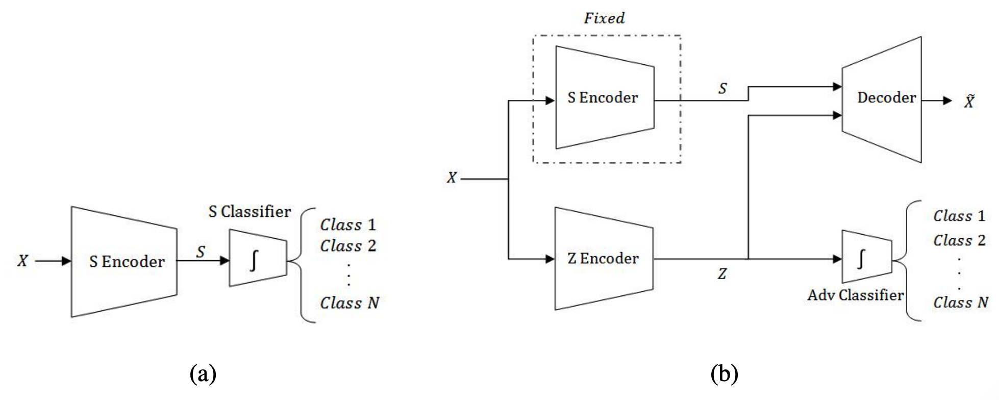

# Two-Step Disentanglement for Financial Data
This is Pytorch implementation of ["Two-Step Disentanglement for Financial Data"](https://arxiv.org/abs/1709.00199). 

Using this method, we disentangled topic-wise and market-wise impact on Korean stock prices. 
- ["Clustering National Security Threats Using Two-Step Disentanglement Method On Stock Prices"]({{https://lyusungwon.github.io}}/assets/publications/[2018추계]서울대학교_산업공학과_최민.pdf), Minh Choi, Sungwon Lyu, Sungzoon Cho, Korea Data Mining Society 2018 Fall Conference, Special Session Best Paper

# Requirements
- Pytorch 0.4

# Result
## Loss

Accuracy of the first step(left) and loss of the second step(right).

## Embedding of Z

Embedded Zs of unstable periods(left) and of peaceful periods(right).

## Analysis of Z 

The distribution of Zs of major provocations by North Korea. 